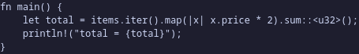

# socr

Select a region of the screen, OCR it, and get the text on your clipboard.
One small binary (~650 KB), one Rust dependency (`png`), no daemon.

It uses whatever screenshot and clipboard tools your desktop already has:

| Session | Capture | Clipboard |
|---|---|---|
| Hyprland, Sway, river, niri, Wayfire, labwc (wlroots) | `grim` + `slurp` | `wl-copy` |
| KDE Plasma | `spectacle` | `wl-copy` / `xclip` |
| GNOME Wayland (and any desktop with xdg-desktop-portal) | XDG portal (built in, no extra tool) | `wl-copy` |
| X11 (i3, Openbox, XFCE, Cinnamon, MATE…) | `maim`, `scrot`, `xfce4-screenshooter`, `gnome-screenshot`, `import` | `xclip` / `xsel` |
| Anywhere | `flameshot` | |

If the preferred backend fails, the next one is tried. `socr --list-backends`
shows the order used on your machine. Pin one with `-b NAME` or `SOCR_BACKEND=NAME`.

OCR is done by `tesseract`. Before OCR, socr converts to grayscale, inverts
dark themes, stretches contrast and upscales small text to the size tesseract
reads best, which makes a big difference on screenshots.

## Example

A dark-theme code snippet:



`socr` copies:

```
fn main() {
let total = items.iter().map(|x| x.price * 2).sum::<u32>();
println! ("total = {total}");
```

## Install

**Arch (AUR)**, two flavours of the same program:

| Package | OCR model | Installed size (with deps) |
|---|---|---|
| `socr` | full English model (`tesseract-data-eng`) | ~32 MB |
| `socr-lite` | bundled fast English model (4 MB) — quicker, ideal for screen text | ~14 MB |

```sh
yay -S socr-lite        # or: yay -S socr
```

Uninstall (also removes tesseract & co. if nothing else needs them):

```sh
sudo pacman -Rns socr-lite   # or socr
```

**From source:**

```sh
./install.sh            # builds and installs to ~/.local/bin
rm ~/.local/bin/socr    # uninstall
```

socr uses models from `~/.local/share/socr/tessdata/` (then
`/usr/share/socr/tessdata/`) when they contain every requested language,
otherwise tesseract's own data directory.

Runtime requirements: `tesseract` plus a language pack (`tesseract-data-eng` on
Arch, `tesseract-ocr-eng` on Debian/Ubuntu, `tesseract-langpack-eng` on Fedora),
a capture tool from the table above, and `wl-clipboard` or `xclip`.

## Usage

```
socr                 select a region → text on clipboard
socr -j              join wrapped lines into paragraphs
socr -p              also print the text
socr -l eng+deu      several languages
socr -f image.png    OCR an existing image ('-' reads stdin)
socr -b portal       force a capture backend
```

Exit codes: `0` copied, `1` error, `2` cancelled, `3` no text found.

## Hotkeys

Let socr add the shortcut for your desktop (Hyprland, Sway, i3, niri, river,
GNOME, KDE, XFCE):

```sh
socr --bind                  # Super+Shift+T
socr --bind print            # or any combo: ctrl+alt+o, super+F5, ...
```

It shows exactly what it will change and asks first. Config files are backed
up to `*.socr-bak` before editing.

> **Heads-up:** this edits your desktop configuration. If the chosen keys are
> already bound to something else, that binding may stop working or be
> replaced. Check your existing shortcuts first.

Or add it by hand:

```ini
# Hyprland  (~/.config/hypr/hyprland.conf)
bind = SUPER SHIFT, T, exec, socr

# Sway / i3  (~/.config/sway/config, ~/.config/i3/config)
bindsym $mod+Shift+t exec socr
```

## License

MIT
